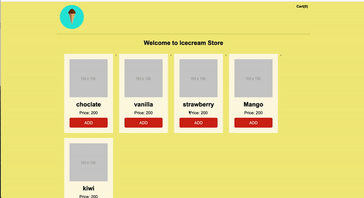

# E-commerce Cart in JavaScript, HTML5, and CSS3

### JSLovers x Progate Learning Jam

Date: 31st May 2020 | Time: 7:00 PM IST

## Who I am?
Hello!! I am Neha Sharma, working as UI Manager at HCL Software. I am also the founder of JSLovers and big advocate of Accessibility.

[Twitter](https://twitter.com/hellonehha) | 
[Linkedin](https://www.linkedin.com/in/nehha) |
[JSLovers Discord](https://discord.gg/89QtcRw)

## Past workshop

- [SASS Learning JAM](https://github.com/Neha/SASS-workshop)

## What to expect in this session
Theory is good but unless and until we won't implement the concepts in real-world we won't learn.This session is going to be a hands-on session of how to build a ecommerce-cart module in pure HTML5, CSS3, JavaScript. Yes, without using any framework. 

## What we will build?

## Agenda of this Session
We will try our best to finish in 1.5hrs. If not, we will have follow up session.

- HTML5
 - How to build a HTML page
- CSS3
  - How to style the HTML page
- JavaScript
  - DOM manipluation
  - Style manipulation
  - Routing of the pages
  - Data Handling
  - and many more
- ParcelJS

## YouTube viceos

Session one: [HTML](https://youtu.be/doIHKP4QfMc)

Session Two: [CSS](https://youtu.be/Vu0Dt14zLU8)

  ## How to follow this session
1) The whole session is breaked into 7-8 small exercise
2) Yes, it will be available on github.com/neha
3) There are important concepts per exercise. Important for interviews and web development. If
you want to make notes grab a notebook and pen/paper. 
Yes, these are the part of the GitHub but fun fact, do you know when you write down something there are chances you'll remember it.
4) I will explain the concept per exercise after that I will code. We will take max 10 minutes break to give you time to code (If Needed).
4) If any issue or any issue drop your question in chat and I'll answer them.

## Few important concepts we discussed:

1) Semantic HTML
2) Headings order
3) DIV vs Section
4) Flexbox
5) display properties
6) display:none vs visibility: hidden
7) CSS structure

Where to reach after talk? Neha@jslovers.com 

Happy Learning!!